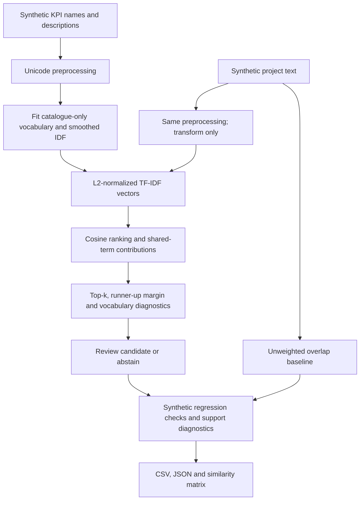
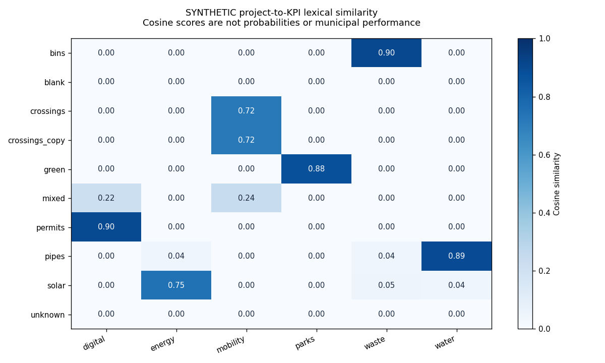

# Municipal Project & KPI Matching

An offline NLP workflow that ranks KPI descriptions against municipal project
text and exposes the lexical evidence behind each suggestion. It supports an
analyst reviewing possible project-to-indicator mappings; it does not measure
municipal outcomes or decide whether a project achieved a KPI.

**All bundled projects, KPI descriptions, and expectations are invented.**
Synthetic cases demonstrate behavior, not real-world matching accuracy. This
release implements similarity retrieval, not a supervised classifier. No legacy
accuracy, F1, or cross-validation result is accepted as verified evidence.

## Architecture



## Engineering choices

**The catalogue defines the feature space.** KPI names and descriptions are
concatenated, normalized with Unicode NFKC/case-folding, tokenized into words of
at least two characters, and filtered through a small versioned English
stopword list. The vocabulary and document frequencies are fitted on the KPI
catalogue only. Incoming projects cannot change the representation of earlier
queries. No model download, private data, or network request is needed.

**The ranking is mathematically inspectable.** The standard-library implementation
uses raw token counts, smoothed IDF `log((1 + N)/(1 + df)) + 1`, L2 normalization,
and cosine similarity. The matching output retains each shared term's normalized
dot-product contribution. A KPI's category is catalogue metadata, not a predicted
classification label. Scores are not confidence estimates or probabilities.

**Top-k is not automatic acceptance.** Rankings use rounded scores and stable KPI
IDs to resolve ties reproducibly. Review decisions inspect the best score and
its margin over the second-best candidate from the entire catalogue. Blank text,
out-of-vocabulary queries, low scores, and narrow margins produce abstentions.
The example cutoffs are declared policies, not calibrated accuracy thresholds.
Even an above-cutoff candidate requires human review.

**Diagnostics expose weak evidence.** Outputs include known-token counts,
out-of-vocabulary terms, all candidate scores, and per-term contributions. A
short query can score highly from a single recognized word; the score alone
cannot establish relevance. Zero-score tail candidates are retained for inspection
but are never presented as positive evidence. The simple baseline uses unweighted
token-set Jaccard overlap, making it possible to inspect whether IDF weighting
changes the ordering without claiming that either ranking is correct.

## Validation rebuilt

The inspected experiments included labels created by thresholding a similarity
score, sometimes alongside that score as an input feature, and oversampling
before a held-out split or cross-validation. Other variants fitted text features
before cross-validation. Their contradictory metrics are all treated as
unverified; apparent success at reproducing a score-derived label is not evidence
of independent semantic matching quality.

This public release does not manufacture a classifier from those labels:

- The matching engine never reads expectation labels; they are consumed only by
  a separate functional-check stage after rankings are produced.
- It does not resample, train a classifier, or run CV. Thus no resampled duplicates
  or full-query-corpus transformations enter an alleged held-out evaluation.
- Tests assert that new queries cannot alter catalogue vocabulary/IDF or existing
  query results. Catalogue order and case/punctuation changes have explicit tests.
- The report exposes expected-category counts, duplicate unigram text groups,
  and the absence of independent labels. Small, imbalanced synthetic support is
  not repaired by duplicating examples or reported as classification performance.
- Precision, recall, F1, accuracy, confusion matrices, and CV scores are withheld.
  The authored cases are regression tests, not a sampled evaluation population.

A future supervised study would require independent relevance judgments and
project/family-grouped splits **before** fitting or resampling. Vectorization must
fit inside each training fold; any sampler belongs inside a training-only
pipeline. Grouped held-out evaluation, class support, simple baselines, per-class
precision/recall/F1, and a confusion matrix would then need justification. Those
steps are a future protocol, not implemented model-performance claims.

See [validation and evidence boundaries](docs/validation.md).

## Reproduce

Python 3.10 or later:

```sh
python -m pip install -r requirements.txt
python -B -m unittest discover -s tests -v
python -B run_pipeline.py --input data/sample/fixture.json --output outputs/sample
```

The core matcher and validation use the standard library. The pinned plotting
dependency generates a static matrix. Repeated runs with identical input and
the same rendering environment produce byte-identical exports, including the
PNG; automated tests compare them. Font/library changes across environments can
change image bytes. There are no timestamps or machine paths in the outputs.

## Sample outputs

The fixture has six KPI descriptions and ten project texts, including an exact
normalized-text duplicate, a deliberately ambiguous one-word query, unseen
vocabulary, and an empty project. The ten authored fixture checks pass. This is
a software regression result, **not a percentage accuracy claim**.

| Artifact in `outputs/sample/` | Purpose |
| --- | --- |
| `candidates.csv` | Top-k suggestions with category, score, review decision, margin and shared terms |
| `rankings.json` | All similarities, token coverage, OOV terms and explanations |
| `baseline.json` | Unweighted overlap ranking for comparison |
| `evaluation.json` | Per-case functional checks, label-support limitations, duplicate groups; metrics explicitly null |
| `validation.json` | Input/catalogue hashes, preprocessing version, policy and review requirement |
| `catalogue_model.json` | Catalogue IDs and fitted IDF weights for inspection |
| `similarity.png` | Exact score matrix for synthetic project/KPI pairs |



CLI exit code 0 means fixture checks passed, 2 means a fixture expectation failed,
and 1 indicates invalid input or an output error. Human acceptance of a match is
separate from all of these conditions.

## Recovered work and limitations

The original workflow loaded project/KPI tables, preprocessed text, applied
TF-IDF/cosine matching, exported best or top-five matches, and explored score
distributions and later classifiers. This implementation preserves the defensible
lexical retrieval path. Catalogue-only fitting, explicit abstention, term-level
explanations, a baseline, duplicate diagnostics, and automated tests are remediation.
Legacy neural-embedding experiments and classifier metrics are not represented
as validated public capabilities.

The public matcher is unigram lexical retrieval. It has no stemming, synonym
model, sentence embeddings, negation understanding, calibrated probability, or
multilingual semantic validation. Unicode characters are preserved, but the small
stopword list is English and the fixture is English. Catalogue wording and size
affect rankings; projects may legitimately relate to several KPIs. No municipal
performance conclusion, causal finding, or production-scale benchmark is claimed.
